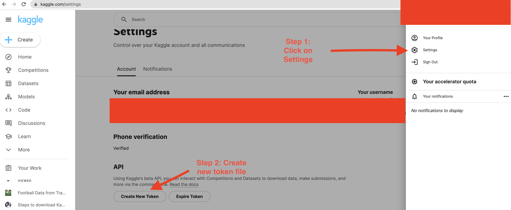

## Midterm Project 2023

### Ideas
- User match level soccer data from [statsbomb](https://github.com/statsbomb/open-data/blob/master/doc/Open%20Data%20Matches%20v3.0.0.pdf) to predict the outcome of a match
    - Pass a pair of teams and use the history of their matchups to predict who will win

- Instead, use data from Transfermarkt to build a prediction service that given a match up between two teams, produces the top 3 most likely scorers for each team and the probability of each of them scoring

### Local project set up instructions
1. Clone this repo: 
2. Use poetry to install all dependencies:
    - ```poetry install```
    - And then start a virtual environment shell using ```poetry shell```
3. Download the data using the kaggle API:
    - Navigate to the data/ directory: ```cd data```
    - You should have already installed the kaggle API through poetry, but you need a kaggle API token
        - If not, just do a ```pip install kaggle```
    - To do that, follow these [steps](https://www.kaggle.com/discussions/general/156610)
    - Here's how you generate a kaggle.json file containing your kaggle API key 
        - Remember, the kaggle.json file must be in your ```~/.kaggle/``` directory for the kaggle API to work
4. Once your kaggle API key is set, you can download the data by doing the following: ```kaggle datasets download -d davidcariboo/player-scores```


### Data
- Source code from transfermarkt: https://github.com/dcaribou/transfermarkt-datasets
- While the source code above can be used to download the data and schedule it to update, it seems a bit easier to download it from Kaggle:
    - https://www.kaggle.com/datasets/davidcariboo/player-scores/data
- The easiest way to download the data is by using the kaggle API (see deployment steps above)

